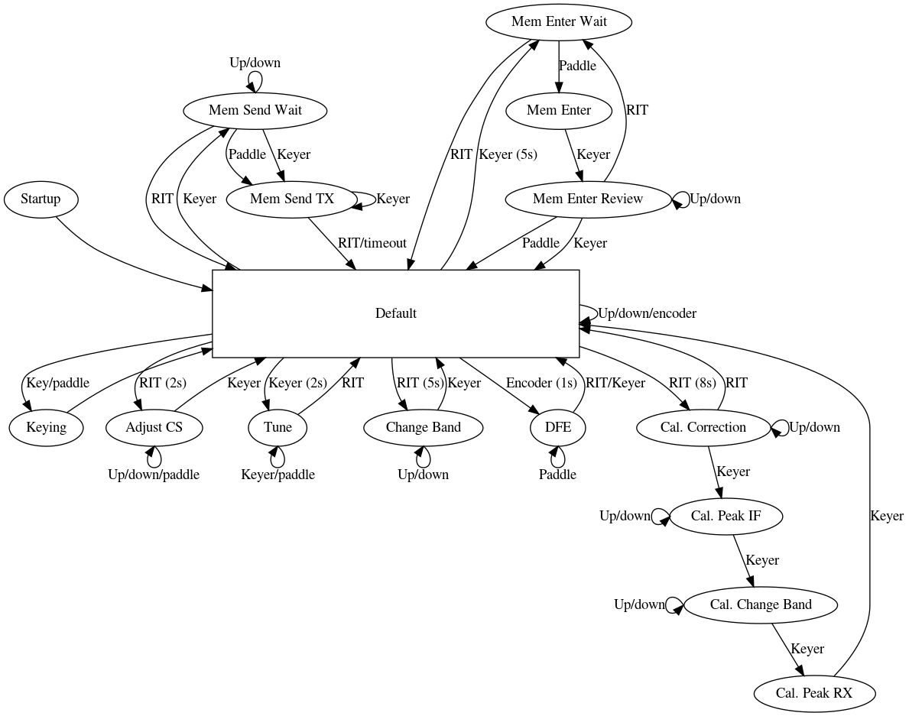

# ATSAMF source

This repository contains the software for the [ATSAMF][], a multiband QRP CW
transceiver with discrete components, based on the ATS and SODA POP designs by
[Steve Weber (KD1JV)][KD1JV] and developed by Rick Rabouw (PA5NN).

The software is based on [Camil Staps (PA5ET)][PA5ET]'s
[software][sodapop-source] of the [SODA POP][sodapop], with additional features
and a larger display.

The original software of the SODA POP was written by Steve. The [alternative
version][sodapop-source] was written by Camil with contributions by [David
Giddy (VK3IL)][VK3IL]. The adaptation to the ATSAMF is by Camil.

This is open source software, copyright &copy; Steve Weber, Camil Staps, and
David Giddy, and licensed under GPL v3 (see the LICENSE file).

---

- [Flashing the firmware](#flashing-the-firmware)
- [Operation](#operation)
- [Compile-time settings](#compile-time-settings)
- [Optional features](#optional-features)

---

## Flashing the firmware

1. Download this repository from
   https://github.com/camilstaps/ATSAMF-source/archive/master.zip.
2. In the Arduino IDE open `ATSAMF/ATSAMF.ino`.
3. Using `Sketch` &rarr; `Manage Libraries`, install the `Etherkit Si5351`
   library by Jason Milldrum.
4. Download
   https://github.com/ladyada/Adafruit_CharacterOLED/archive/master.zip and add
   it to the IDE using `Sketch` &rarr; `Include Library` &rarr;
   `Add .ZIP Library`.
5. Connect the device to your computer and upload the sketch.

## Operation

Operation is similar to that described in the [SODA POP][sodapop] manual.
It can be described by the state machine below.
A detailed description is given under the image.

### Startup
On startup, the band will be shown. After a 1.5s delay, the rig turns on.

### Tuning
Use the rotary encoder to tune. Tuning can be done in steps of 10Hz, 100Hz,
1kHz and 10kHz. Rotate through these steps by pressing the rotary encoder. For
all steps except 10Hz, the corresponding digit on the display will blink.

Direct Frequency Entry (DFE) can be used by holding the encoder button for 1s.
It is only available when a paddle is connected. The display reads `DFE`. Key
in the desired frequency. The current digit blinks. Save with the keyer switch
or cancel with the RIT switch. When all four digits are entered, the new
frequency is saved automatically. Abbreviations can be used for 0 (T) and 9
(N) and for all numbers when enabled (see under
[Optional features](#optional-features)).

### RIT
Pressing the RIT button turns RIT on. This allows you to fix the transmitting
frequency and receive at an offset of up to &plusmin;10kHz. The display shows
the RIT offset.

### Tune mode
Pressing the RIT button for 2s turns tune mode on. In this mode, the keyer
switch enables and disables transmission, which is useful when tuning the
antenna. Use RIT to go back.

### Message memory
Pressing the keyer switch allows you to send a message from memory. Select the
right memory using the rotary encoder and press KEYER. Use the RIT switch to
cancel.

When a message is being transmitted, you can still use the RIT switch to cancel
it. You can also enter beacon mode by pressing the keyer switch. In beacon
mode, the message is repeated continuously with an adjustable delay in between
(see `BEACON_INTERVAL` under [Compile-time settings](#compile-time-settings)).
During transmission, the keys are only checked *between* the transmitted
characters, so you'll have to hold the buttons longer than normally.

To update the memory, hold the keyer switch for 5s. Enter the message using the
paddle. This is not possible with a straight key. An open circle in the right
bottom blinks once after a character space is detected; a closed circle blinks
after a word space has been detected. To finish, press the keyer switch again.
The message will be played back. After this, store the message with the rotary
encoder and the keyer switch. Pressing the RIT switch allows you to key in a
message again; pressing the RIT switch once more returns to the default state.

The maximum message length is 64 by default (can be changed in `settings.h`).
If you try to enter more characters, the error routine is enabled (see below).

### Preferences
Change the code speed by holding the keyer switch for 2s. Use the paddle or the
rotary encoder to change, and save with the keyer switch.

Change the band by holding the RIT switch for 5s. Save with the keyer switch.

### Calibration
The calibration routine is explained in the manual. Hold the RIT switch for 8s
to enter the calibration routine. This proceeds through the following steps:

1. Correct the Si5351 frequency. Connect a frequency counter to TP3 and turn
   the rotary encounter to obtain 10MHz.
2. Correct the intermediate frequency (IF). First adjust CT3 to peak the signal
   on TP2. Then adapt the frequency using the rotary encoder to peak the signal
   on TP1 *with a scope*. If the IF had to be changed, readjust CT3; repeat
   until both TP1 and TP2 are peaked.
3. Select the right band with the rotary encoder.
4. Peak the signal with CT1 and CT2. The adjustment can be sharp, especially on
   the higher frequency bands.

Pressing the keyer switch returns to the default state.

### Errors
When an error is detected, the display shows `Error` and an alarm signal is
given on the sidetone. You need to power cycle the device.

## Compile-time settings
There are several compile-time settings in `settings.h`. Change them before
uploading the code to the chip.

- `WPM_DEFAULT`: the default key speed in WPM (20).
- `KEY_MIN_SPEED`: the minimum key speed in WPM (5). Lower speeds than 5 may
  damage the rig, because the on-time for dashes will be rather long.
- `KEY_MAX_SPEED`: the maximum key speed in WPM (30). Higher speeds than 30 are
  untested and may present timing issues.
- `SIDETONE_FREQ`: the frequency of the sidetone in Hz (600).
- `MEMORY_LENGTH`: the maximum length of messages in memory, including word
  spaces (64). Higher values than 255 are unsupported.
- `MEMORY_EEPROM_START`: the start address of the memory in EEPROM (16). Don't
  change this unless you know what you're doing.
- `BEACON_INTERVAL`: the number of dot times between two transmissions of a
  message in beacon mode. A dot time is 1.2s / WPM (e.g. a beacon interval of
  15 means 1.5s on 10WPM).
- `TUNING_STEPS`: an array of tuning steps in mHz. These steps are rotated
  through with the encoder button.
- `TUNING_STEP_DIGITS`: which digit to blink when in a tuning step. An array of
  the same length as `TUNING_STEPS`. Values should be taken from `BLINK_NONE`,
  `BLINK_0`, `_1`, `_2` and `_3` (`0` is the rightmost digit).
- There are several band plans. Define one of `PLAN_IARU1`, `_IARU2`, `_IARU3`,
  `_VK`.
  The exact boundary definitions are in `bands.h`.
- Change the default operating frequency of a band by defining e.g.

      #define DEFAULT_OP_FREQ_20 1405500000

## Optional features
There are several features that can be added to the rig if you want to. This is
done by adding and removing `#define` lines to `settings.h`.

- `OPT_ERASE_EEPROM`: erase the EEPROM by holding RIT for 11s.
- `OPT_OBSCURE_MORSE_ABBREVIATIONS`: adds number abbreviations to DFE according
  to the table below. Abbreviations for 0 (T) and 9 (N) are always enabled.

  | Letter | Number
  ---|---
  | A | 1
  | U | 2
  | W | 3
  | V | 4
  | S | 5
  | B | 6
  | G | 7
  | D | 8

[KD1JV]: http://kd1jv.qrpradio.com/
[PA5ET]: https://camilstaps.nl
[VK3IL]: https://www.vk3il.net/
[sodapop]: https://groups.yahoo.com/neo/groups/AT_Sprint/files/SODA%20POP/
[sodapop-source]: https://github.com/camilstaps/SODA-POP-source
[ATSAMF]: https://a03.veron.nl/projectvoorstel-pa5nn-zelfbouw-qrp-hf-cw-transceiver/
